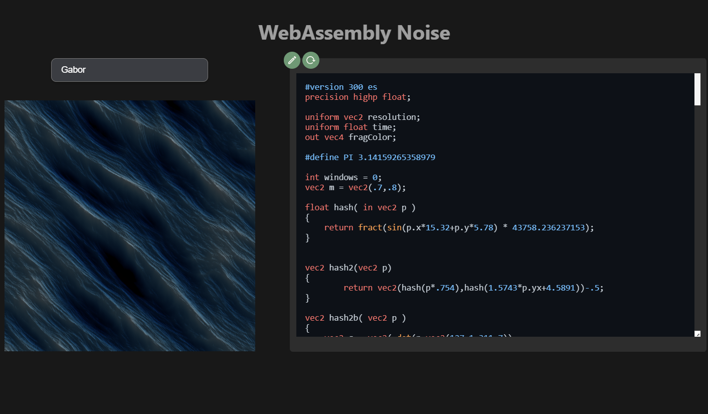

# WebAssemblyNoise
A WebAssembly project about porting noise calculations C++ to a vue Application

I use MingW through MSYS2, and you will need to install emscripten.
Emscripten allow you to transpile C++ code into Js. The whole WebAssembly thing.

- build.bat (build the WebAssembly module)
- start.bat (Install vue packages and start the frontend)